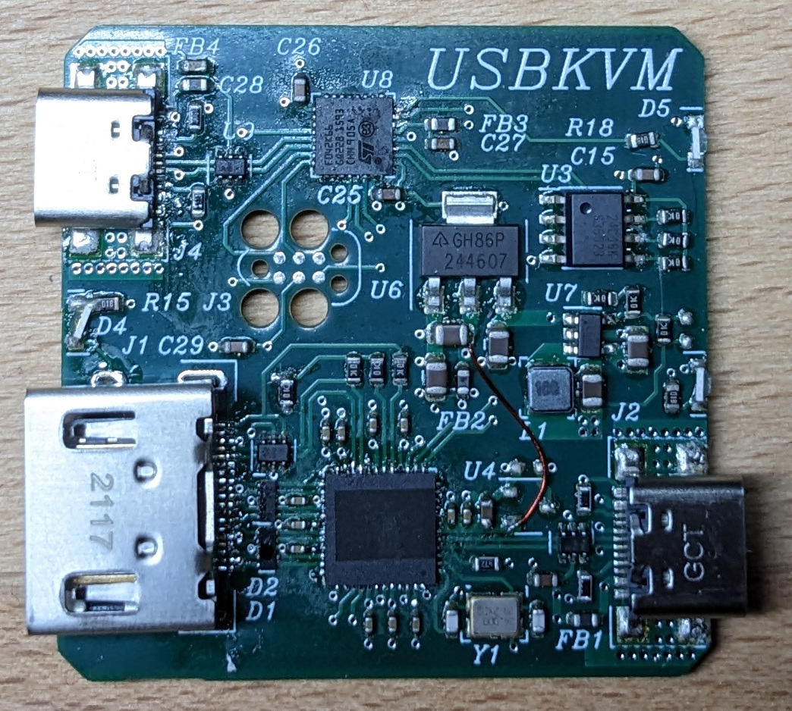

USBKVM
======

You know this? Your home server won't ping anymore and now you gotta 
get a monitor and a keyboard to fix it, but can't find anywhere to put 
them?

Introducing USBKVM, a matchbox-sized keyboard, video monitor and mouse 
that you can use from the comfort of the screen and input devices you 
already have. It's just like a KVM over IP console you may find in a server 
rack, but without the network in between.

# Hardware

USBKVM is built around the MS2109 HDMI to USB capture IC that's found 
on virtually all cheap USB 2.0 HDMI capture sticks. It's not stocked by 
any of the usual distributors, I got mine from 
[klayers.net](https://www.klayers.net/product/ms2109/). They came with 
the [marking lasered 
off](https://chaos.social/@karotte/111456303962668464), which made me a bit suspicious that I've been 
scammed, but they work just like the original. So I either got the real 
deal or a perfect clone.

Turns out that this chip has an I²C controller builtin and people 
[reverse engineered](https://github.com/BertoldVdb/ms-tools/) to the 
point that it can be used to communicate with arbitrary I²C devices.

This I²C side channel is used to talk to an STM32F042 MCU that emulates 
USB keyboard and mouse.

Apart from these two chips, there's not much else on the board other 
than some voltage regulators, ESD protection diodes and an I²C EEPROM 
that holds configuration data for the MS2109.

The differential pairs for HDMI and USB are designed for JLCPCB's 7628 
stackup.

As usual, this board is made with [Horizon 
EDA](https://horizon-eda.org/). [Schematics](hw/usbkvm/output/schematic.pdf)

The modwire is there because I forgot to order the voltage regulator 
for the 3.3V USB supply.

# Software

Conceptually, the client is pretty simple as it only has to do these 
two jobs:
 1. Display the captured video feed. The MS2109 implements the USB 
 video device class, just like a webcam.
 2. Send keyboard and mouse input the the MCU via the aforementioned I²C 
 interface

To get some video on the screen quickly, the client started out as a 
GStreamer Gtk example, first part done!

The second part however 
required some more work as the code that makes use of the MS2109's I²C 
interface is written in Go. After realizing that it's a surprisingly 
substantial amount code, I quickly scrapped the idea of reimplementing 
it in C++ and instead figured out how to compile it as a static library 
that I can integrate into my C++ project.

The protocol layer used for communicating with the MCU firmware is defined in 
a header file that's both included by the client an the firmware. Some 
care has to be taken to get the same struct packing on both platforms.

To keep the firmware simple, the client has to send USB HID scan codes, 
so it has to generate them from the key codes it receives from Gtk.
Not wanting to reinvent the wheel, I looked into the 
sources of software that has has to accomplish a similar task, in 
particular the [SPICE Gtk 
client](https://gitlab.freedesktop.org/spice/spice-gtk), and discovered 
the [keycodemap](https://gitlab.com/keycodemap/keycodemapdb) project. 
It provides a mapping table from the X11 keycodes used by Gtk to HID 
scancodes among some other codes used by different platforms.

Since I was too lazy to figure out how to properly capture the mouse to 
emit relative movements, USBKVM emulates an absolute pointing device. While this works perfectly 
on Windows and Linux, it's completely broken in less sophisticated 
environments such as UEFI setup utilities or option ROMs.

# Firmware

The firmware uses the excellent USB stack 
[tinyusb](https://github.com/hathach/tinyusb) to emulate the 
aforementioned absolute pointing devices as well as a standard USB HID 
keyboard. After having used the USB device stack included in the STM32 
HAL in some previous projects, I can't recommend tinyusb enough. It's 
really good as far as anything involving USB goes.

On the other end, it implements an I²C peripheral to receive commands 
from the MS2109. After some fiddling, I got it to work reliably 
without clock stretching since I don't think the MS2109 supports that. 
One side-effect of that is that the first byte the MCU has to send in a 
read transaction has to be loaded into the transmit data register even 
before the address is received since the time between the SCL edge that 
latches the last address bit and the first edge that clocks out the 
first data bye isn't long enough to prepare the data to be sent.

## Firmware updates

For updating itself without special programming adapters, the firmware 
can activate the built-in ROM bootloader of the STM32. Unfortunately, I 
picked the wrong pins so only the USB DFU bootloader can be used and 
not the I²C one. Run `make dfu` in the firmware directory to build and 
flash the firmware.

Future improvement: Implement a custom I²C bootloader, that will also 
make the device less brickable since the activating the ROM bootloaders 
requires a working firmware.

# Case

As usual, the case is of the 3D-printed kind. It consists of the 
obround main housing and a lid to close it up. The lid attaches with two M2 screws 
that go into nuts located in the main housing.

The case was designed in [Dune 3D](https://dune3d.org/).

# Frequently asked questions

## Why doesn't this already exist?

Good question, given that at least
[three](https://news.ycombinator.com/item?id=39471860) 
[people](https://digipres.club/@foone/111948980229300662)
[independently](https://ioc.exchange/@azonenberg/110849751773610561)
asked the same thing. All of the key components 
are available off the shelf and USBKVM wasn't exactly hard to put 
together, 
so I guess it's mostly a question of time until someone else would have 
figured it out as well.

While writing this README, I stumbled upon 
[openinterface.com](https://openterface.com/) which appears to be 
pretty much the same thing as USBKVM. Zooming into [one of their PCB 
photos](https://twitter.com/TechxArtisan/status/1755577720568750462), 
they're also using the MS2109, what a coincidence! Looking at their 
subreddit they just went live less than two months ago.

## Why is this using such an obscure chip from a Chinese vendor?

I thought about how USBKVM would look like if I had to make it from 
parts I could get from Digikey. The best solution I could come up with 
would be using
a large MCU with camera input and High-Speed USB and then somehow 
connecting an HDMI to parallel RGB 
converter to its camera interface. While this could also have 
eliminated the MCU used for HID emulation, it's much more complex and 
expensive than the single QFN-48 IC that is the MS2109.

## How about VGA input?

A variant that'll also have a VGA input is currently work in progress. 
It'll use a VGA to HDMI converter IC and a HDMI multiplexer for 
switching between the two inputs.

## How can I get one?

I have no plans to commercially offer USBKVM since I don't 
want to deal with the hurdles of manufacturing and selling hardware 
products.

If you're in the business of manufacturing and selling hardware, feel 
free to take the design files and turn USBKVM into a product people can 
buy! Just keep in mind that the firmware and client app are under GPL 
when making modifications to it.

## What platforms does the client run on?

Right now, the client app builds and runs on Linux. Windows support is 
experimental as it's significantly more involved to determine the 
correct video capture device.

## Are there plans for clients for other platforms?

Right now, no. You're more than welcome to implement a client for your 
favourite platform based on the client included in this repo.

# Future improvements

While there's not much to improve on the hardware as it is right now, 
the client app still has a lot of room for improvement.

 - Handle disconnecting the USBKVM more gracefully, potentially allow 
 reconnects
 - Improved feedback for when no USBKVM is found
 - Make sure that it handles non-US keyboard layouts on both ends
 - Relative mouse emulation, requires firmware support
 - Firmware updates via I²C, requires firmware support
 - Screen recording, should be easy to add to the GStreamer pipeline
 - Instant replay to show screen content that just scrolled by
 - Translating text input into keyboard events for pasting text
 - Key macros for repeatedly pressing keys
 - OCR for copying text from the video feed

# Licenses

 - Firmware and client: GPLv3
 - Hardware and Case: CERN Open Hardware Licence Version 2 - Permissive
